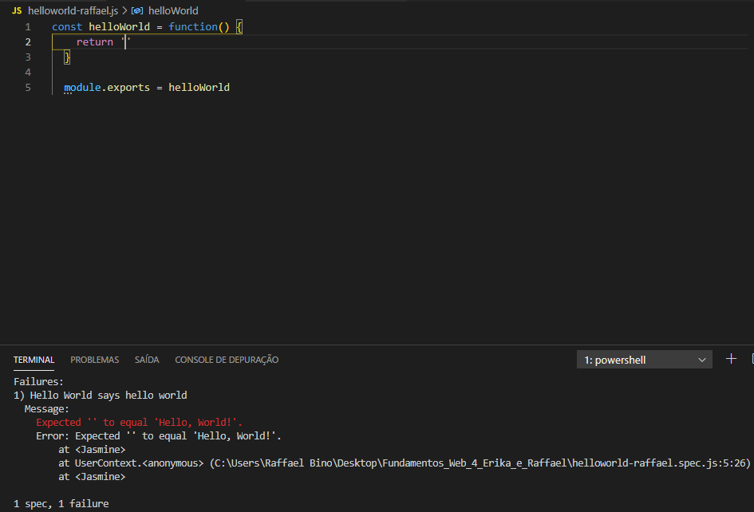
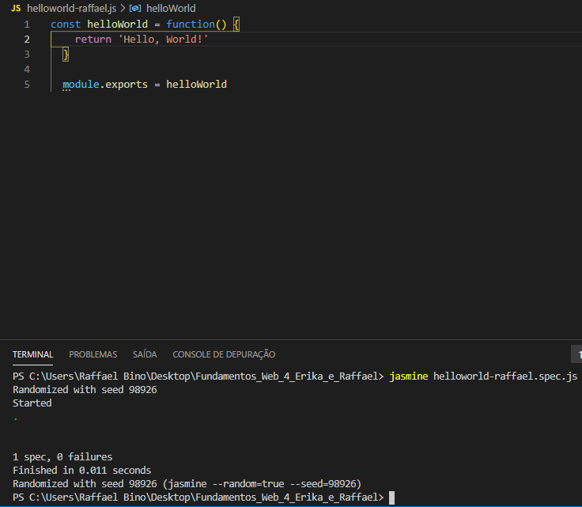
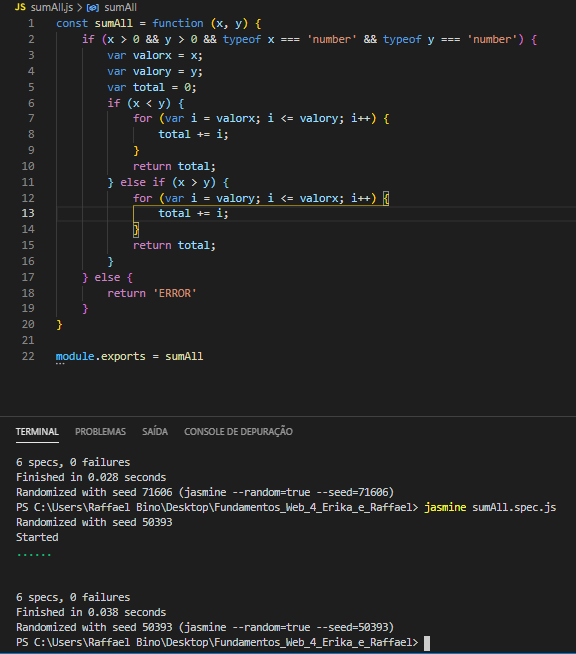
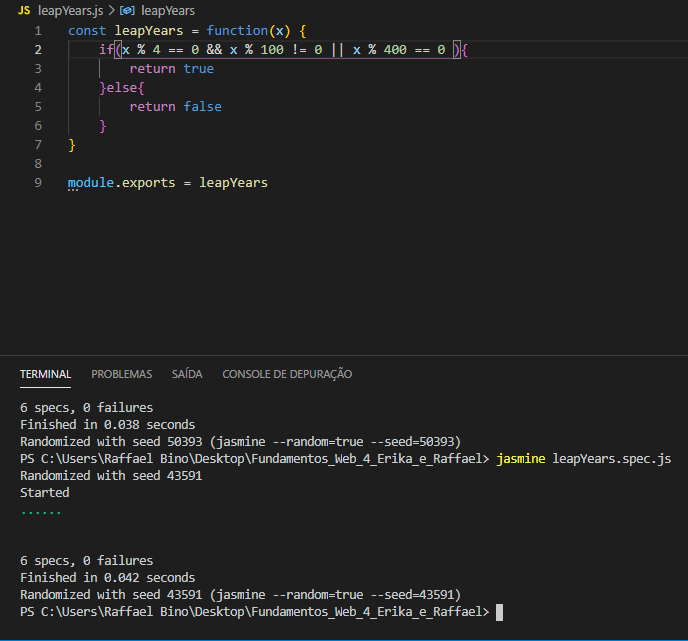
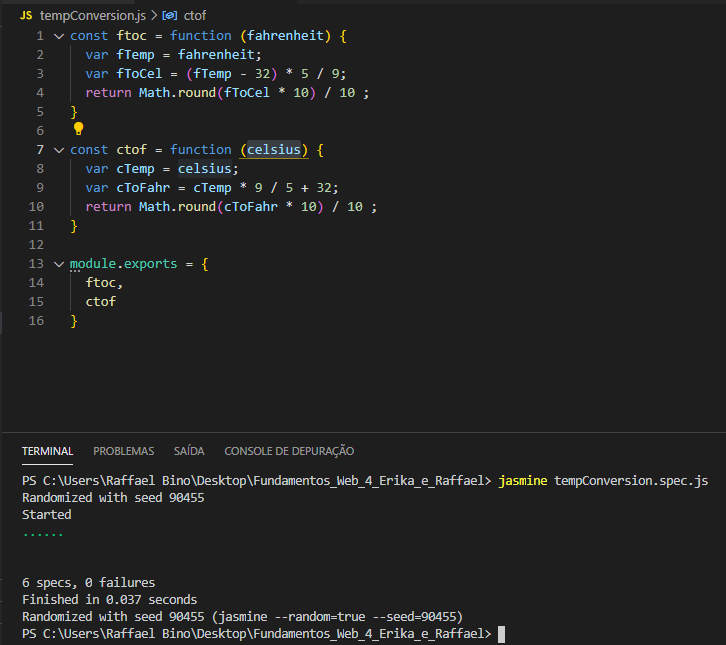
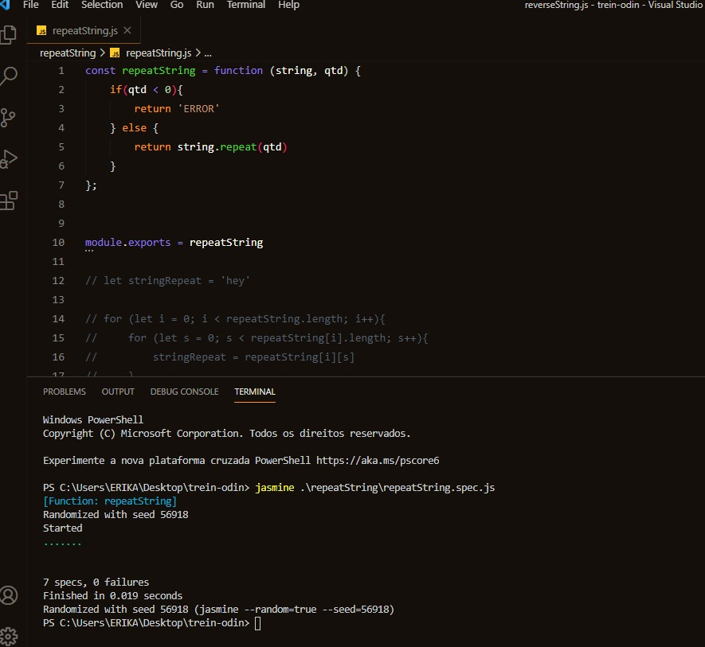
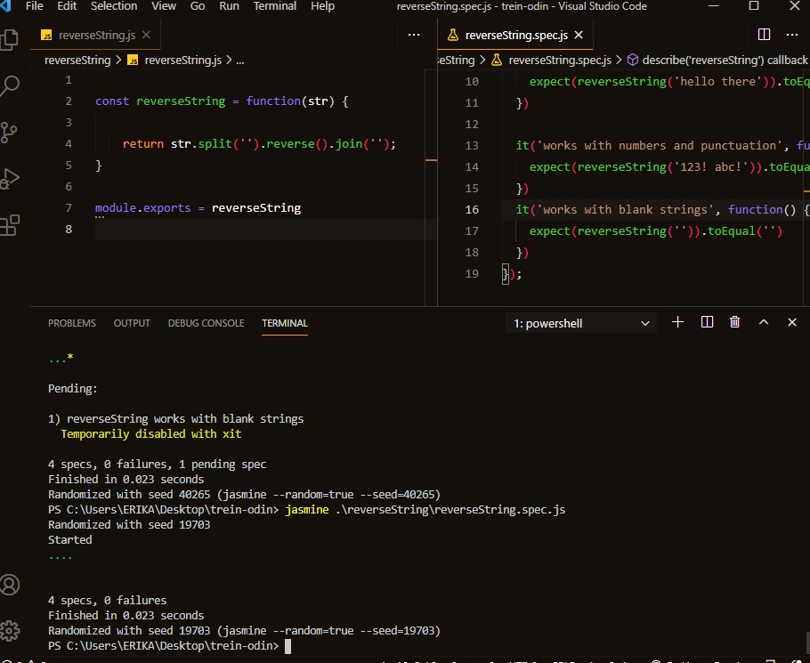
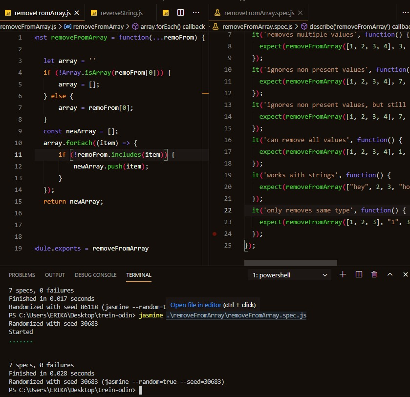

# Fundamentos_Web_4_Erika_e_Raffael

<h3>Código e o Resultado de Falha no TDD do Exerc Hello World</h3>

<h3>Código e o Resultado de Sucesso no TDD do Exerc Hello World</h3>

<h3>Código e o Resultado do TDD do Exerc sumAll</h3>

<h3>Código e o Resultado do TDD do Exerc leapYears</h3>

<h3>Código e o Resultado do TDD do Exerc tempConversion</h3>

<h3>Erika -> repeatString: </h3>

<h3>Erika -> reverseString: </h3>

<h3>Erika -> removeFromArray: </h3>
